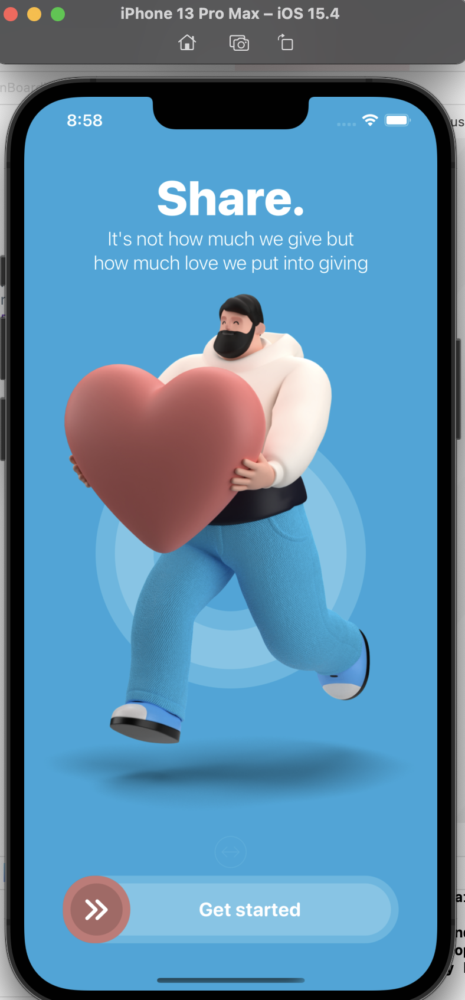

# Restart App using Swift UI

The main goal of this project to create complex UI gestures and
 use multiple movements in the opposite direction

## Authors

- [@Enjy12345](https://github.com/Enjy12345)

## 🚀 About Me
I'm a IOS Developer ...

## Screenshots

## 🔗 Links

## 🛠 Skills
Swift , Swift UI and Firebase.

